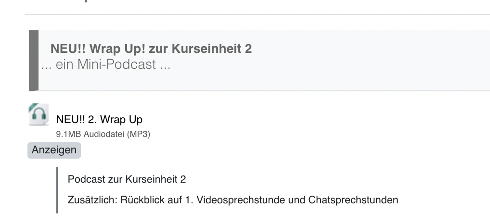
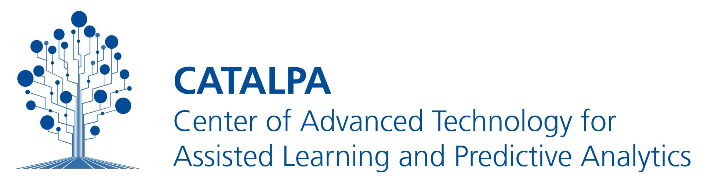

<!-- TODO:
- upload to zenodo
- link to the tex2html converter and mention footnotes
- provide example HTML structures for footnotes, references, images, tables, and headlines in separate document
- set tag 'latest'
- done: make animation `ffmpeg -ss 00:00:12.000 -i headline.mov -pix_fmt rgb24 -r 10 -s 720x480 -t 00:02:38.000 headline.gif`
-->


<br>
<div align="center">

</a>

</div>

<br>
<h1 align="center">Headline</h1>

## *Headline* is a Moodle activity plugin that adds a subheading to the course overvoew page.


*Headline* (mod_headline) is a structural element for course contents. It is a moodle plugin that aims to support visual guidances in large courses. In addition to topic sections the headlines provide a second level in the course structure. 

<!-- development-related badges -->
[](https://github.com/CATALPAresearch/mod_headline/commit-activity)
[](https://github.com/CATALPAresearch/mod_headline/commit/)
[](https://github.com/CATALPAresearch/mod_headline/contributors/)
[](https://github.com/CATALPAresearch/mod_headline/issues/)
[](http://perso.crans.org/besson/LICENSE.html)


<!-- Maturity-related badges 
see: https://github.com/mkenney/software-guides/blob/master/STABILITY-BADGES.md
-->
[](https://github.com/mkenney/software-guides/blob/master/STABILITY-BADGES.md#mature)


<!-- AI-related and LA-related badges -->
<!-- 
https://nutrition-facts.ai/

Privacy Ladder Level
Feature is Optional
Model type
Base model
Base Model Trained with Customer Data
Customer Data is Shared with Model Vendor
Training Data Anonymized
Data Deletion
Human in the Loop
Data Retention
Compliance
-->


<br><br>
<p align="center" hidden>
  
</p>

<p align="center">
  <a href="#key-features">Key Features</a> •
  <a href="#how-to-use">How To Use</a> •
  <a href="#download">Download</a> •
  <a href="#credits">Credits</a> •
  <a href="#related">Related</a> •
  <a href="#citation">Citation</a> •
  <a href="#license">License</a>
</p>


## Key Features

The main features *Headline* are:
* clear distinction from other elements listed on the course overview page
* customizable headline text
* additional notes can be desplayed below the headline text
* tested with Boost themes


## How To Use

To clone and run this application, you'll need [Git](https://git-scm.com) and [Node.js](https://nodejs.org/en/download/) (which comes with [npm](http://npmjs.com)) installed on your computer. From your command line:

```bash
# Clone this repository
1. Clone  the repository to /your-moodle/mod/
$ git clone git@github.com:catalparesearch/mod_headline.git

# Rename the folder to 'headline'
$ mv mod_headline headline

# Go into the repository
$ cd headline

# Install dependencies
$ npm install

# Build the plugin by transpiling the vue code into javascript
$ npm run build

# Open the page https://<moodle>/admin/index.php?cache=1 and follow the install instructions for the plugin or
$ php admin/cli/uninstall_plugins.php --plugins=mod_headline --run

# To install the *Headline* plugin afterwards, copy the repository downloaded in the 1. step into the `mod` folder in the folder your Moodle installation is located in replacing the current `mod/headline` folder containing the regular *Page* plugin. Now, login to your Moodle running as an administrator. The install/update GUI should open automatically. Just follow the steps the GUI presents to you and you should have installed the *Headline* plugin successfully afterwards. As an alternative to using the GUI for installation, you can also run the update script from within the folder of your Moodle installation:
$ php admin/cli/upgrade.php

# Open a Moodle course of you choice and add headline as an activity to your course.

```

## Getting into Development

See the file index.php for the DOM structure and take a look at css/headlines.css about the styling.


## Emailware

*Headline* is an [emailware](https://en.wiktionary.org/wiki/emailware). Meaning, if you liked using this plugin or it has helped you in any way, I'd like you send me an email at <niels.seidel@fernuni-hagen.de> about anything you'd want to say about this software. I'd really appreciate it!


## Citation

> Seidel, N. (2024). Headline - A Moodle activity plugin for adding subsection headings to course overview pages. https://github.com/CATALPAresearch/mod_headline

````
@misc{Seidel2024-MoodleHeadline,
author = {Seidel, Niels},
keywords = {P-APLE-II,open data,software},
title = {{Headline - A Moodle activity plugin for adding subsection headings to course overview pages}},
url = {https://github.com/CATALPAresearch/mod{\_}headline},
year = {2024}
}
```

## You may also like ...

* [format_serial3](https//github.com/catalparesearch/format_serial3) - Learning Analytics Dashboard for Moodle Courses

## License

[GNU GPL v3 or later](http://www.gnu.org/copyleft/gpl.html)


## Contributors
* Niels Seidel [@nise81](https://twitter.com/nise81)

---
<a href="https://www.fernuni-hagen.de/english/research/clusters/catalpa/"></a>
<a href="https://www.fernuni-hagen.de/"></a>


